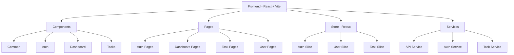
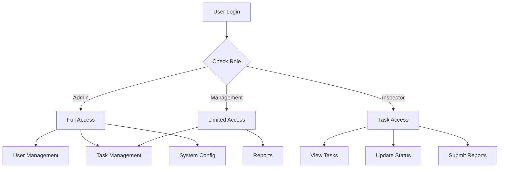

# MIRSAT Portal

## Project Overview

MIRSAT Portal is a comprehensive task management and inspection system with role-based access control. The system supports multiple user roles including Admin, Management Team, and Inspectors, with the flexibility to add more roles as needed.

## Architecture Overview



## Role-Based Access Flow



## Project Structure

```
mirsat-portal/
├── src/
│   ├── components/
│   │   ├── common/
│   │   ├── auth/
│   │   ├── dashboard/
│   │   ├── tasks/
│   │   └── users/
│   ├── pages/
│   │   ├── auth/
│   │   ├── dashboard/
│   │   ├── tasks/
│   │   └── users/
│   ├── store/
│   │   ├── slices/
│   │   └── store.js
│   ├── services/
│   ├── utils/
│   ├── hooks/
│   └── layouts/
```

## Role-Based Components Examples

### Permission Gate Component
The PermissionGate component controls access to features based on user permissions:

```jsx
const CreateTaskButton = () => {
  return (
    <PermissionGate permission="create_task">
      <Button variant="contained" startIcon={<AddIcon />}>
        Create Task
      </Button>
    </PermissionGate>
  );
};

const UserManagement = () => {
  return (
    <PermissionGate role={ROLES.ADMIN}>
      <Card>
        <CardHeader title="User Management" />
        <CardContent>
          {/* User management content */}
        </CardContent>
      </Card>
    </PermissionGate>
  );
};
```

## Setup Instructions

### Prerequisites
- Node.js >= 16.x
- npm >= 8.x
- MongoDB >= 5.x

### Installation

1. Clone the repository:
```bash
git clone https://github.com/your-org/mirsat-portal.git
cd mirsat-portal
```

2. Install dependencies:
```bash
npm install
```

3. Create .env file:
```bash
cp .env.example .env
```

4. Start development server:
```bash
npm run dev
```

## Available Scripts

```bash
npm run dev        # Start development server
npm run build      # Build for production
npm run preview    # Preview production build
npm run lint       # Run ESLint
npm run lint:fix   # Fix ESLint errors
npm test          # Run tests
```

## Key Features

### Admin Role
- User Management (CRUD operations)
- Task Assignment
- System Configuration
- Reports Generation

### Management Role
- Task Creation & Assignment
- Performance Monitoring
- Report Generation

### Inspector Role
- Task View & Updates
- Photo Upload
- Report Submission

## API Integration

### Authentication
```javascript
// services/auth.service.js
export const login = async (credentials) => {
  const response = await api.post('/auth/login', credentials);
  return response.data;
};
```

### Task Management
```javascript
// services/task.service.js
export const createTask = async (taskData) => {
  const response = await api.post('/tasks', taskData);
  return response.data;
};
```

## Security Features

- Role-Based Access Control (RBAC)
- JWT Authentication
- Request Rate Limiting
- Input Validation
- XSS Protection

## Contributing

1. Fork the repository
2. Create a feature branch
3. Commit your changes
4. Push to the branch
5. Create a Pull Request

## License

MIT License - see LICENSE.md

## Support

For support, email support@mirsat-portal.com or raise an issue in the repository.

## Theming

MIRSAT uses a consistent theme system based on CSS variables. The theme is defined in `src/index.css` and `src/config/theme.js`.

### Theme Colors

The application uses a custom color palette designed specifically for the MIRSAT brand:

- Primary: Deep Navy Blue (#1A3A5F), Soft Teal (#4B8C9E), Light Seafoam (#A9CDCE)
- Secondary: Sand Beige (#E3D9CA), Muted Coral (#E99B83), Pale Sky Blue (#D6E5EA)
- Neutrals: Off-White (#F7F9FA), Light Gray (#E2E8ED), Medium Gray (#8CA3B7), Dark Slate (#2D4654)
- Status Colors: Success (#7CB797), Warning (#DFBE7F), Error (#D18C92), Info (#7CA7C8)

### Theme Documentation

Complete theme documentation is available in `src/docs/THEMING.md`. This includes:

- Detailed color palette with usage guidelines
- Component styling guidelines
- Theme integration methods
- Status indicators and compliance levels

### Theme Utilities

Use the theme utilities in `src/utils/themeUtils.js` for complex theming scenarios.

### Theme Checker

Run the theme checker script to identify hardcoded colors that should be replaced with theme variables:

```bash
# Install dependencies if needed
npm install glob --save-dev

# Run the theme checker
node scripts/theme-checker.js
```

This will scan your code for hardcoded colors and suggest replacements using theme variables.


flowchart TD
    A[User Authentication] --> B[Role Check]
    B --> C{Permission Gate}
    
    C -->|Admin| D[Full Access]
    C -->|Management| E[Limited Access]
    C -->|Inspector| F[Task Access]
    
    D --> D1[User CRUD]
    D --> D2[Task CRUD]
    D --> D3[System Settings]
    D --> D4[All Reports]
    
    E --> E1[Task Create]
    E --> E2[Task Assign]
    E --> E3[View Reports]
    
    F --> F1[View Tasks]
    F --> F2[Update Status]
    F --> F3[Upload Photos]


    